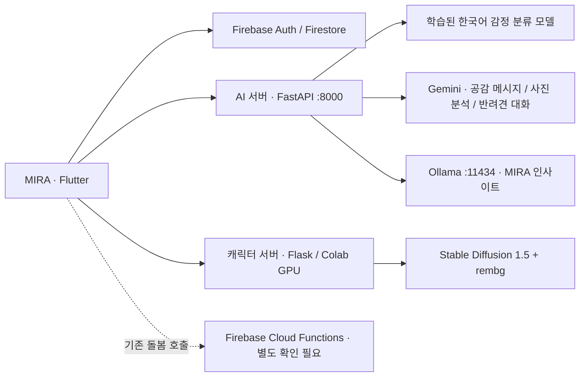

<div align="center">

# MIRA

### Moments In Resonance, Always

**함께한 순간이 서로의 마음에 오래 울리도록**

가족의 감정과 일상을 기록하고, 함께 반려견을 돌보며 대화를 이어가는 가족 소통 플랫폼


[기능](#features) · [실행 방법](#start) · [개발 상태](#status) · [팀 소개](#team)

</div>

## 프로젝트 소개

MIRA는 각자의 오늘 감정과 가족에게 공유하고 싶은 이야기를 구분해 기록하는 서비스입니다. 가족 이야기와 사진에 반응하고, 주간 퀘스트를 함께 완료하며, MIRA 인사이트와 반려견 대화를 통해 일상 속 대화의 계기를 만듭니다.

현재 통합 앱은 **`Frontend/mira`**입니다. 아래 내용은 PR #31까지 머지된 구현을 기준으로 하며, 초기 기획서의 기능 목록과 실제 구현 상태를 구분합니다.

<a id="features"></a>
## 주요 기능

| 기능 | 현재 구현 |
| --- | --- |
| 계정과 가족 연결 | 이메일 회원가입·로그인, 초대 코드로 가족 참여, 이름·역할·프로필 설정 |
| 나의 오늘 감정 | 감정 태그와 한 줄 기록, 감정 분류 및 Gemini 공감 메시지 연동 |
| 가족 이야기 | 가족에게 공유할 글 작성, 좋아요·댓글, 작성자 수정·삭제 |
| 가족 사진첩 | 사진 공유와 반응, 역할 대신 실제 작성자 이름 표시 |
| 패밀리 무드 | 오늘 기록한 가족별 최신 감정 중 ‘기쁨’의 비율. 기록이 없으면 ‘기록 전’ 표시 |
| 패밀리 에너지 | 이번 주 글·사진·좋아요·기존 돌봄 완료 기록·퀘스트에서 계산한 활동 점수 |
| 가족 퀘스트 | 매주 2개: 가족 모두 이야기 하나씩 남기기, 가족 사진 한 장 공유하기 |
| 일일 퀘스트 | 오늘 감정·이야기·기존 돌봄 완료 기록과 연결된 진행도 |
| MIRA 인사이트 | 가족 프로필과 최근 공개 이야기를 참고하는 Ollama 대화, 말풍선·입력창·재시도 |
| 반려견 설정 | 이름·견종·털 특징 입력, 사진에서 견종·색상 분석, 별도 서버의 캐릭터 생성 |
| 반려견 성격 테스트 | 기다림·새 친구·귀가 인사·새 장난감 반응에 대한 4문항, 문항별 3개 선택지 |
| 반려견과 대화 | 이름과 성격 테스트 답변을 전달해 행동 성향에 따른 말투를 Gemini 대화에 반영 |

### 기록과 점수의 기준

- **오늘의 감정**과 **가족 활동 / 가족 이야기**를 구분하고, 각각 기록 버튼과 설명을 제공합니다.
- 패밀리 무드는 사용자가 직접 선택한 감정으로 계산합니다. AI 감정 분류 결과를 점수로 바꾸는 방식은 아닙니다.
- 패밀리 에너지: 공유 글·사진 각각 10점, 해당 게시물의 좋아요 2점, 기존 돌봄 완료 5점, 주간 퀘스트 각각 40점입니다.
- 가족 퀘스트와 에너지는 **한국 시간 월요일 00:00**부터 한 주 단위로 집계합니다. 같은 사람의 반복 글은 가족 참여 인원을 늘리지 않습니다.
- 점수는 실제 기록에서 다시 계산하므로 삭제하거나 좋아요를 취소하면 함께 바뀝니다.
- 인사이트 문맥에는 비공개 감정 일기 원문과 사진 바이트를 넣지 않습니다. 대화 기록은 현재 화면 세션 동안 유지됩니다.

### 화면 디테일

기존 색상과 카드 스타일을 유지하면서 온보딩의 MIRA 의미, 단어 단위 줄바꿈, 단색 기본 프로필, 퀘스트 완료 숫자 정렬을 정리했습니다. ‘살펴볼 신호’는 설명을 왼쪽에, 숫자를 오른쪽 고정 열에 배치했습니다. 반려견 입력란과 인사이트의 고정 예시는 제거했습니다.

자세한 계산 기준과 기능 설명은 [실제 가족 기록과 성격 대화](docs/live-family-features.md)를 참고하세요.

## 서비스 구성



AI 대화 서버와 캐릭터 생성 서버는 별도 프로세스입니다. **Colab에서 캐릭터 서버만 켜도 감정 분석이나 MIRA 인사이트가 실행되는 것은 아닙니다.** 현재 대화 구현은 Gemini와 Ollama를 사용합니다.

| 위치 | 용도 |
| --- | --- |
| `Frontend/mira` | 현재 통합 Flutter 앱과 테스트 |
| `Backend/ai-server` | 감정 분석·사진 분석·반려견 대화·인사이트 API |
| `Backend/character-server` | GPU 기반 캐릭터 이미지 생성 서버 |
| `Backend/functions` | Firebase Cloud Functions 코드, Node.js 20 |
| `Backend/firestore.rules` | 계정·가족 기록 접근 권한 |
| `docs` | 기능 기준과 인계 문서 |

<a id="start"></a>
## 로컬 실행

현재 확인한 실행 환경은 Windows, Python 3.11, Dart 3.11.5를 포함하는 Flutter SDK와 Chrome입니다. Flutter 의존성은 `pubspec.lock`과 `pubspec_overrides.yaml`을 함께 사용합니다. Ollama 설치와 사용할 Gemini 모델의 API 접근 권한도 필요합니다.

### 1. 저장소와 Firebase 준비

```powershell
git clone https://github.com/kikimiya0606/capstone-project.git
cd capstone-project
```

팀 Firebase 프로젝트의 이메일/비밀번호 인증과 Firestore를 사용합니다. 다른 프로젝트로 실행한다면 `Frontend/mira/lib/firebase_options.dart`와 플랫폼별 Firebase 설정을 해당 프로젝트에 맞춰 준비하세요.

### 2. AI 서버 실행

저장소 루트에서 실행합니다.

```powershell
cd Backend/ai-server
py -3.11 -m venv .venv
.\.venv\Scripts\python.exe -m pip install -r requirements.txt
```

`Backend/ai-server/.env`를 만들고 본인 환경의 값을 넣습니다.

```dotenv
GEMINI_API_KEY=your_gemini_api_key
GEMINI_MODEL=your_available_gemini_model_id
EMOTION_MODEL_PATH=your_finetuned_model_path_or_huggingface_repo
OLLAMA_BASE_URL=http://127.0.0.1:11434
OLLAMA_MODEL=qwen3:4b
```

`GEMINI_MODEL`은 사용할 수 있는 실제 모델 ID로, `EMOTION_MODEL_PATH`는 학습된 감정 모델 경로로 바꿔야 합니다. 기본 `klue/bert-base`만으로는 학습된 6종 감정 분류를 대신할 수 없습니다. 모델의 라벨 순서는 `불안 / 분노 / 상처 / 슬픔 / 당황 / 기쁨`입니다. 비공개 Hugging Face 모델은 별도 접근 인증이 필요합니다.

```powershell
.\.venv\Scripts\python.exe -m uvicorn app.main:app --host 127.0.0.1 --port 8000
```

상태 확인: `http://127.0.0.1:8000/health`, API 문서: `http://127.0.0.1:8000/docs`. 상태 확인 응답만으로 각 AI 모델의 연결까지 검증되는 것은 아닙니다. `.env`를 수정하면 AI 서버를 다시 시작하세요. `.env`와 실제 키는 커밋하지 않습니다.

### 3. Ollama 실행

별도 터미널에서 모델을 준비합니다.

```powershell
ollama pull qwen3:4b
```

Ollama 앱이 실행 중이면 기본 주소 `127.0.0.1:11434`를 사용합니다. 서버가 실행되지 않은 환경에서는 `ollama serve`로 시작합니다. MIRA 인사이트에는 Ollama와 위 AI 서버가 모두 필요합니다.

### 4. Flutter를 Chrome에서 실행

저장소 루트의 새 터미널에서 실행합니다.

```powershell
cd Frontend/mira
flutter pub get
flutter run -d chrome --dart-define=AI_SERVER_BASE_URL=http://127.0.0.1:8000
```

앱의 AI 서버 기본 주소는 `http://localhost:8000`입니다. `AI_SERVER_BASE_URL`은 Flutter 실행 시 설정값이므로 주소를 바꾸면 해당 옵션으로 앱을 다시 실행합니다. 실기기에서는 PC에 접근할 수 있는 주소와 서버 바인딩 설정을 사용해야 합니다.

### 5. 캐릭터 생성 서버 연결

캐릭터 이미지 생성에는 GPU 서버 또는 Colab 세션이 추가로 필요합니다. [캐릭터 서버 실행 안내](Backend/character-server/README.md)를 따라 실행한 뒤, `Frontend/mira/lib/services/character_server_service.dart`의 `_characterServerBaseUrl`을 현재 서버 주소로 바꾸고 앱을 다시 실행하세요. Colab을 재시작하면 터널 주소도 확인해야 합니다.

반려견 사진 분석은 AI 서버의 Gemini를, 캐릭터 이미지 생성은 별도 캐릭터 서버를 사용합니다. 사진에서 추출한 견종·색상과 기준 이미지를 바탕으로 생성하며, 업로드한 사진 자체로 개별 반려견을 학습하는 흐름은 아닙니다.

## API

| 서버 | 엔드포인트 | 용도 |
| --- | --- | --- |
| AI 서버 | `GET /health` | 프로세스 상태 확인 |
| AI 서버 | `POST /analyze-mood` | 감정 분류와 본인·가족용 공감 메시지 |
| AI 서버 | `POST /analyze-pet-photo` | 반려견 사진에서 견종·털 특징 추출 |
| AI 서버 | `POST /pet-chat` | 성격 답변을 참고한 반려견 대화 |
| AI 서버 | `POST /insight-chat` | 가족 공유 문맥을 참고한 Ollama 대화 |
| 캐릭터 서버 | `POST /generate` | 캐릭터 PNG 생성 |

<a id="status"></a>
## 개발 상태와 인계 사항

- **돌봄 배정은 별도 수정 대상입니다.** PR #31에는 매일 랜덤 배정·한 명에게 여러 행동 배정·직접 Firestore 저장 변경을 포함하지 않았습니다. 현재 main은 기존 Cloud Functions 호출 방식을 유지하며, 돌봄 상태를 불러오지 못하는 문제는 미해결 상태입니다.
- 운영 Firebase에는 앞선 작업의 돌봄 규칙이 배포되어 저장소 규칙과 차이가 있습니다. 돌봄 담당자가 규칙과 서비스 구현을 함께 확인해야 합니다. PR #31에서는 Firebase를 재배포하지 않았습니다.
- 반려견 성격 테스트의 **대화 반영은 포함**되지만, Colab 캐릭터 생성의 새 성격 매핑은 별도 담당자가 작업합니다. 현재 앱의 이미지 생성 요청은 기존 성격 키를 사용합니다.
- 인사이트에 일기 원문을 전달하지 않는 것과 별개로, 현재 Firestore의 `moods` 읽기 권한은 가족 구성원 단위입니다. 개인 일기의 서버 측 읽기 권한 분리는 후속 검토 사항입니다.
- 루트 `firebase.json`의 Hosting 경로는 기존 `Frontend/familyapp/build/web`을 가리킵니다. MIRA 웹 배포 시 `Frontend/mira/build/web`에 맞춘 설정 확인이 필요합니다.
- 초기 기획의 타임캡슐·정원 성장·AI 데일리 질문·정기 감정 리포트는 이 문서에서 현재 통합 앱의 완료 기능으로 표시하지 않습니다.

## 검증

PR #31 기준 Flutter 정적 검사, Flutter 테스트 **21개**, AI 서버 테스트 **13개**, Chrome용 웹 빌드가 통과했습니다. 실제 모델 호출과 배포 환경 연결은 별도 실행 설정이 필요합니다.

```powershell
# Frontend/mira에서
flutter analyze --no-pub
flutter test --no-pub
flutter build web --no-pub

# Backend/ai-server에서
.\.venv\Scripts\python.exe -m pytest -q
```

Windows의 한글 경로에서 Flutter 엔진·셰이더 오류가 발생하면 SDK·프로젝트의 영문 드라이브 별칭과 영문 `TEMP`/`TMP` 경로를 사용하는 개발 환경 구성을 확인하세요.

<a id="team"></a>
## 👥 팀 구성

<div align="center">

> **팀명:** 에이원하조 (A1HaJo) · **과목:** AI 캡스톤 디자인 2026 · **소속:** 동양미래대학교

<br/>

| 이름 | 역할 | 주요 담당 업무 |
|:---:|:---:|:---|
| 권유진 | PM / Full-Stack | 프로젝트 기획 및 서비스 전략 수립, 프론트엔드(Flutter)·백엔드(AI 통합) 시스템 설계 및 개발 총괄, 개발 일정·리소스 관리 및 팀 협업 조율, 서비스 품질 관리 및 기술 의사결정 |
| 강민서 | Backend / AI | AI Hub 기반 감정 분석 모델 학습 및 연동, Hugging Face 모델을 활용한 게이미피케이션 기능 개발, 사용자 입력 데이터 실시간 처리 및 감정 기반 알림/팝업 시스템 구현, 서버 아키텍처 설계·API 제공·성능 최적화 및 안정성 관리 |
| 차은비 | Backend / AI | AI Hub 기반 감정 분석 모델 학습 및 연동, Hugging Face 모델을 활용한 게이미피케이션 기능 개발, 사용자 입력 데이터 실시간 처리 및 감정 기반 알림/팝업 시스템 구현, 서버 아키텍처 설계·API 제공·성능 최적화 및 안정성 관리 |
| 정윤도 | Frontend | Figma를 활용한 UI/UX 설계 및 프로토타입 제작, Flutter 기반 반응형 웹·모바일 화면 개발, 감정 분석 결과 및 게이미피케이션 요소 시각화 구현, 사용자 피드백 기반 UI 개선 및 디자인 시스템 유지 |
| 김란아 | Frontend | Figma를 활용한 UI/UX 설계 및 프로토타입 제작, Flutter 기반 반응형 웹·모바일 화면 개발, 감정 분석 결과 및 게이미피케이션 요소 시각화 구현, 사용자 피드백 기반 UI 개선 및 디자인 시스템 유지 |

</div>

## 라이선스

[MIT License](LICENSE)
